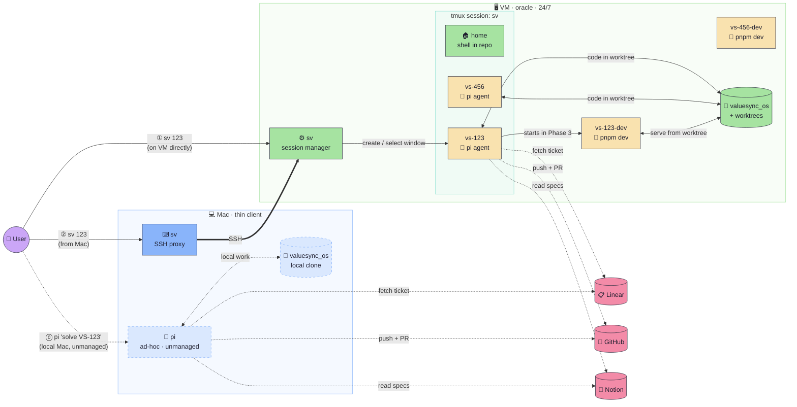

# sv — Solve ticket session manager (v3)

CLI that manages the full lifecycle of Linear ticket work on a VM: a single tmux session with per-ticket windows, git worktrees, and pi agent launches.

Three ways to solve a ticket — same pi skill, different entry points.

## Entry points

| # | How | Where it runs | Managed by sv? |
|---|-----|---------------|----------------|
| ⓪ | `pi 'solve VS-123'` typed directly | Mac, local clone | No — ad-hoc, unmanaged |
| ① | `sv 123` on the VM | VM, tmux window + worktree | Yes |
| ② | `sv 123` on the Mac | Mac → SSH → VM | Yes (via SSH proxy) |

⓪ is the simplest path: you open pi on your Mac and type a prompt. No tmux, no worktree isolation, no persistence across reboots. It works in your local clone.

① and ② are the managed paths. `sv` creates a window in the `sv` tmux session, launches `pi 'solve VS-123'` inside it, and the pi agent's solve-ticket skill takes over. The VM runs 24/7 — you detach with `ctrl-b d` and come back later. Switch between tickets with `ctrl-b n`/`ctrl-b p` or `ctrl-b <number>`.

② is just ① tunneled over SSH. The Mac has a thin proxy that forwards the command.

## Overview



The dashed ⓪ path is unmanaged — sv doesn't know about it. The solid ①② paths are what sv controls.

## Detailed — sv decision tree + pi skill phases

```mermaid
flowchart TD
    cmd(["`👤 **sv 123 [--flags]**`"])

    subgraph mac_phase["💻 Mac · sv proxy"]
        direction TB
        proxy["SSH proxy\n~/.local/bin/sv"]
        ssh_setup["SSH Phase 1\nsv --no-attach 123\nsetup · no TTY"]
        ssh_attach["SSH Phase 2\nssh -t oracle\ntmux attach -t sv\ninteractive · with PTY"]
    end

    subgraph vm_phase["🖥️ VM · sv decision tree"]
        direction TB
        norm["Normalize\n123 → VS-123 → vs-123"]

        is_list{"--list?"}
        cmd_list["cmd_list\n· scan sv session windows\n· scan worktree dirs\n· scan git branches\n· print ● / ○ status\n· show +ahead / −behind"]

        is_bare{"no ticket?"}
        cmd_bare["ensure_sv_session\nAttach to sv session\n(lands on last active window)"]

        is_shelve{"--shelve?"}
        cmd_shelve["cmd_shelve\n· kill window sv:vs-123\n· kill session vs-123-dev\n· git worktree remove\n· git worktree prune\n🗃️ branch + PR preserved"]

        is_close{"--close?"}
        cmd_close["cmd_close\n· cmd_shelve (quiet)\n· gh pr close\n· git push origin --delete\n· git branch -D\n🗑️ all state cleaned"]

        ensure_sess["ensure_sv_session\ncreate sv session + home\nwindow if missing"]

        has_win{"window vs-123\nin sv session?\n(and not --fresh)"}
        is_alive{"is_alive?\npane not dead\ncmd ≠ zsh/bash"}
        reattach["♻️ Reattach\nensure_worktree\nselect window · attach sv"]
        kill_idle["Kill idle / dead window\ntmux kill-window"]

        is_fresh{"--fresh?"}
        fresh_clean["Clean slate\n· kill window sv:vs-123\n· kill session vs-123-dev\n· git worktree remove --force\n· git worktree prune"]

        has_branch{"Branch\nvs-123 exists?"}
        resume["♻️ Resume shelved ticket\n· ensure_worktree:\n  git worktree add\n  ln -s .env.local\n  pnpm install\n· tmux new-window in sv\n· open shell (no agent)"]

        new_ticket["🚀 New ticket\n· tmux new-window in sv\n  named vs-123 · in repo\n· pi 'solve VS-123 - comment'"]
    end

    subgraph skill_phase["🤖 pi agent · solve-ticket skill"]
        direction TB
        s1["Phase 1 · Understand\n· linear get_issue VS-123\n· notion get_page (linked specs)\n· grep codebase for affected code\n· check blockers\n· incorporate --comment context"]
        s2["Phase 2 · Plan\n· present plan: changes, files, risk\n· ✋ wait for user approval"]
        s3["Phase 3 · Workspace\n· git worktree add -b vs-123 origin/main\n· ln -s .env.local\n· pnpm install\n· gitexclude .pi-progress.md\n· tmux new-session vs-123-dev 'pnpm dev'\n· poll for 'Ready in' (30s)"]
        s4["Phase 4 · Implement\n· write code in worktree\n· pnpm build after each change\n· monitor vs-123-dev output\n· load sub-skills as needed\n· update .pi-progress.md"]
        s5["Phase 5 · Verify\n· pnpm build (3 retries then ask)\n· pnpm lint\n· check dev server for runtime errors"]
        s6["Phase 6 · Review\n· self-audit via uncommitted-changes\n· fix issues directly\n· present diff → ✋ wait for approval"]
        s7["Phase 7 · Deliver\n· git commit (conventional commits)\n· gh pr create --draft\n  body: Closes VS-123\n· kill tmux vs-123-dev\n· tell user: gwtr vs-123 to clean up"]
    end

    worktree[("📂 worktree\nvaluesync_os_worktrees/vs-123")]
    progress["📄 .pi-progress.md\ncrash recovery · phase tracking"]
    linear[("📋 Linear")]
    github[("🔀 GitHub")]
    notion[("📝 Notion")]
    stop(("✋"))

    %% Entry
    cmd --> proxy
    proxy --> ssh_setup
    ssh_setup -->|"SSH · no TTY"| norm
    cmd -->|"or: directly on VM"| norm

    %% Flag routing
    norm --> is_list
    is_list -->|yes| cmd_list --> stop
    is_list -->|no| is_bare
    is_bare -->|yes| cmd_bare --> stop
    is_bare -->|no| is_shelve
    is_shelve -->|yes| cmd_shelve --> stop
    is_shelve -->|no| is_close
    is_close -->|yes| cmd_close --> stop

    %% cmd_run decision tree (ensure_sv_session first)
    is_close -->|no| ensure_sess
    ensure_sess --> has_win
    has_win -->|yes| is_alive
    has_win -->|no| is_fresh
    is_alive -->|alive| reattach
    is_alive -->|"idle / dead"| kill_idle
    kill_idle --> is_fresh
    is_fresh -->|yes| fresh_clean
    fresh_clean --> has_branch
    is_fresh -->|no| has_branch
    has_branch -->|"yes · shelved"| resume
    has_branch -->|"no · new"| new_ticket

    %% Attach back to Mac
    reattach -.-> ssh_attach
    resume -.-> ssh_attach
    new_ticket -.-> ssh_attach

    %% Skill phases
    new_ticket ==> s1
    s1 --> s2
    s2 --> s3
    s3 --> s4
    s4 --> s5
    s5 --> s6
    s6 --> s7

    %% External interactions — skill
    s1 -.->|"fetch ticket + comments"| linear
    s1 -.->|"read linked specs"| notion
    s3 -.->|"create"| worktree
    s3 -.->|"init"| progress
    s4 -.->|"write code"| worktree
    s4 -.->|"update"| progress
    s7 -.->|"push branch + open draft PR"| github

    %% External interactions — cleanup commands
    cmd_close -.->|"gh pr close"| github
    cmd_close -.->|"git push --delete"| github
    cmd_shelve -.->|"remove"| worktree

    %% Resuming reads progress
    resume -.->|"reads on next pi session"| progress

    style cmd fill:#cba6f7,stroke:#313244,color:#1e1e2e
    style mac_phase fill:#89b4fa15,stroke:#89b4fa
    style vm_phase fill:#a6e3a115,stroke:#a6e3a1
    style skill_phase fill:#f9e2af15,stroke:#f9e2af

    style proxy fill:#89b4fa,stroke:#313244,color:#1e1e2e
    style ssh_setup fill:#89b4fa,stroke:#313244,color:#1e1e2e
    style ssh_attach fill:#89b4fa,stroke:#313244,color:#1e1e2e

    style ensure_sess fill:#a6e3a1,stroke:#313244,color:#1e1e2e
    style norm fill:#a6e3a1,stroke:#313244,color:#1e1e2e
    style is_list fill:#a6e3a1,stroke:#313244,color:#1e1e2e
    style cmd_list fill:#a6e3a1,stroke:#313244,color:#1e1e2e
    style is_bare fill:#a6e3a1,stroke:#313244,color:#1e1e2e
    style cmd_bare fill:#a6e3a1,stroke:#313244,color:#1e1e2e
    style is_shelve fill:#a6e3a1,stroke:#313244,color:#1e1e2e
    style cmd_shelve fill:#a6e3a1,stroke:#313244,color:#1e1e2e
    style is_close fill:#a6e3a1,stroke:#313244,color:#1e1e2e
    style cmd_close fill:#a6e3a1,stroke:#313244,color:#1e1e2e
    style has_win fill:#a6e3a1,stroke:#313244,color:#1e1e2e
    style is_alive fill:#a6e3a1,stroke:#313244,color:#1e1e2e
    style reattach fill:#a6e3a1,stroke:#313244,color:#1e1e2e
    style kill_idle fill:#a6e3a1,stroke:#313244,color:#1e1e2e
    style is_fresh fill:#a6e3a1,stroke:#313244,color:#1e1e2e
    style fresh_clean fill:#a6e3a1,stroke:#313244,color:#1e1e2e
    style has_branch fill:#a6e3a1,stroke:#313244,color:#1e1e2e
    style resume fill:#a6e3a1,stroke:#313244,color:#1e1e2e
    style new_ticket fill:#a6e3a1,stroke:#313244,color:#1e1e2e

    style s1 fill:#f9e2af,stroke:#313244,color:#1e1e2e
    style s2 fill:#f9e2af,stroke:#313244,color:#1e1e2e
    style s3 fill:#f9e2af,stroke:#313244,color:#1e1e2e
    style s4 fill:#f9e2af,stroke:#313244,color:#1e1e2e
    style s5 fill:#f9e2af,stroke:#313244,color:#1e1e2e
    style s6 fill:#f9e2af,stroke:#313244,color:#1e1e2e
    style s7 fill:#f9e2af,stroke:#313244,color:#1e1e2e

    style worktree fill:#fab387,stroke:#313244,color:#1e1e2e
    style progress fill:#fab387,stroke:#313244,color:#1e1e2e
    style linear fill:#f38ba8,stroke:#313244,color:#1e1e2e
    style github fill:#f38ba8,stroke:#313244,color:#1e1e2e
    style notion fill:#f38ba8,stroke:#313244,color:#1e1e2e
    style stop fill:#6c7086,stroke:#313244,color:#cdd6f4
```



## v3 changes from v2

- **Single tmux session.** All tickets are windows inside one `sv` session. Switch tickets with `ctrl-b n`/`ctrl-b p` or `ctrl-b <number>`. The tmux status bar shows all active tickets.
- **Home window.** The `sv` session always has a `home` window (shell in the repo root). It's never killed by shelve/close.
- **Bare `sv`.** Running `sv` with no arguments attaches to the sv session.
- **Dev sessions stay separate.** The pi skill creates `vs-123-dev` as a standalone tmux session (running `pnpm dev`). `sv` cleans them up during shelve/close but doesn't put them in the sv session — they're background processes.

## Commands

```
sv                          Attach to the sv session
sv <ticket>                 Launch agent or reattach
sv <ticket> --fresh         Kill window + worktree, start from scratch (branch preserved)
sv <ticket> --comment "…"   Pass steering context to the agent prompt
sv <ticket> --shelve        Tear down window + worktree, keep branch + PR
sv <ticket> --close         Full cleanup: window, worktree, branch, PR
sv --list | sv -l           Show all tracked tickets with status
```

`--fresh` destroys the tmux window and worktree but keeps the branch and any open PR. The pi agent relaunches from the repo root and the skill decides whether to reuse the existing branch. Use `--close` followed by `sv <ticket>` for a true clean slate including branch deletion.

## Files

| File | Installed to | Purpose |
|------|-------------|---------|
| `bin/sv` | `~/.local/bin/sv` on VM | Main script — session manager |
| `zsh/sv.zsh` | Sourced by zshrc | Tab completion — ticket IDs from sv windows, worktrees, branches |
| `.pi/skills/solve-ticket/SKILL.md` | In valuesync_os repo | The pi skill that does the actual work |
| `.pi/extensions/linear.ts` | In valuesync_os repo | Read-only Linear API (fetch tickets) |
| `.pi/extensions/notion.ts` | In valuesync_os repo | Read-only Notion API (fetch specs) |
